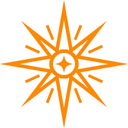

<p align="center">
  
</p>

<h1 align="center">Clipboard Pro</h1>

<p align="center">
  <strong>Quản lý lịch sử clipboard thông minh — Desktop + Web Dashboard + Chrome Extension</strong>
</p>

<p align="center">
  
  
  
  
  
  
</p>

---

## Mục lục

- [Giới thiệu](#giới-thiệu)
- [Tính năng](#tính-năng)
- [Cài đặt](#cài-đặt)
- [Hướng dẫn sử dụng](#hướng-dẫn-sử-dụng)
- [Web Dashboard](#web-dashboard)
- [Chrome Extension](#chrome-extension)
- [Kiến trúc hệ thống](#kiến-trúc-hệ-thống)
- [Build từ source](#build-từ-source)
- [Đóng góp](#đóng-góp)
- [Giấy phép](#giấy-phép)

---

## Giới thiệu

**Clipboard Pro** là ứng dụng desktop quản lý lịch sử clipboard, được xây dựng bằng [Wails v2](https://wails.io) (Go + React). Mọi dữ liệu được lưu trữ **100% local** trên máy bạn bằng SQLite — không cloud, không telemetry, không theo dõi.

Ứng dụng đi kèm:
- **Web Dashboard** tại `http://localhost:27843` để truy cập từ trình duyệt
- **Chrome Extension** tích hợp trực tiếp với trình duyệt

---

## Tính năng

| Tính năng | Mô tả |
|-----------|-------|
| **Lịch sử clipboard** | Tự động lưu mọi text và hình ảnh bạn copy |
| **Tìm kiếm nhanh** | Full-text search với SQLite FTS5 — tìm theo nội dung, tên ứng dụng nguồn, loại dữ liệu |
| **Ghim mục quan trọng** | Pin các mục thường dùng lên đầu danh sách |
| **Phím tắt toàn cục** | `Ctrl+Shift+V` mở app từ bất kỳ đâu |
| **System Tray** | Chạy nền, truy cập nhanh từ khay hệ thống |
| **Pin cửa sổ** | Ghim app nổi trên màn hình như widget (Always on Top) |
| **Khởi động cùng máy** | Tự động chạy khi bật máy (Windows) |
| **Giao diện đẹp** | Dark/Light mode, hỗ trợ tiếng Việt/Anh |
| **Lọc thông minh** | Lọc theo loại (text/image), theo thời gian, theo ứng dụng nguồn |
| **Web Dashboard** | Truy cập lịch sử qua trình duyệt tại `localhost:27843` |
| **Chrome Extension** | Xem và paste clipboard trực tiếp từ Chrome |
| **Bảo mật** | Dữ liệu 100% local, không gửi đi đâu |

---

## Cài đặt

### Windows

1. Tải file `clipboard-pro.exe` từ trang [Releases](../../releases)
2. Chạy file — không cần cài đặt
3. App sẽ xuất hiện ở khay hệ thống (system tray)

### macOS

1. Tải file `clipboard-pro-macos-amd64.zip` từ [Releases](../../releases)
2. Giải nén, kéo `clipboard-pro.app` vào thư mục `/Applications`
3. Lần đầu mở: Click chuột phải → **Open** (để bypass Gatekeeper)

> **Lưu ý macOS:** Tính năng autostart và nhận diện ứng dụng nguồn chỉ hoạt động đầy đủ trên Windows. Các tính năng core (clipboard, search, tray, dashboard) hoạt động bình thường.

### Linux

1. Tải file `clipboard-pro` từ [Releases](../../releases)
2. Cấp quyền thực thi:
   ```bash
   chmod +x clipboard-pro
   ```
3. Chạy:
   ```bash
   ./clipboard-pro
   ```

> **Yêu cầu Linux:** `libgtk-3-0`, `libwebkit2gtk-4.0-37`

---

## Hướng dẫn sử dụng

### Phím tắt

| Phím tắt | Chức năng |
|----------|-----------|
| `Ctrl+Shift+V` | Mở/ẩn cửa sổ Clipboard Pro |
| Click vào mục | Copy nội dung vào clipboard |
| Icon ghim | Ghim/bỏ ghim mục lên đầu |
| Icon xóa | Xóa mục khỏi lịch sử |

### System Tray

App chạy nền ở khay hệ thống:
- **Nháy đúp** icon tray → Mở cửa sổ app
- **Click phải** → Menu:
  - **Show Window** — Mở cửa sổ chính
  - **Open Dashboard** — Mở web dashboard trên trình duyệt
  - **Quit** — Thoát hoàn toàn

### Cài đặt trong App

Truy cập từ icon ⚙️ trong app:
- **Giao diện:** Dark / Light mode
- **Ngôn ngữ:** Tiếng Việt / English
- **Khởi động cùng máy:** Bật/tắt
- **Pin cửa sổ:** Ghim nổi trên màn hình

---

## Web Dashboard

Khi app desktop đang chạy, truy cập dashboard tại:

```
http://localhost:27843
```

**Lần đầu sử dụng:**
1. Mở app desktop → Settings → Copy **Auth Key**
2. Mở `http://localhost:27843` trên trình duyệt
3. Nhập Auth Key để kết nối

Dashboard có đầy đủ tính năng như app: tìm kiếm, lọc, ghim, xóa, copy.

---

## Chrome Extension

### Cài đặt Extension

1. Tải `clipboard-pro-chrome-extension.zip` từ [Releases](../../releases)
2. Giải nén vào một thư mục
3. Mở Chrome → `chrome://extensions`
4. Bật **Developer mode** (góc trên phải)
5. Click **Load unpacked** → Chọn thư mục vừa giải nén
6. Nhập Auth Key từ app desktop vào extension

### Sử dụng Extension

- Click icon extension trên toolbar để mở popup
- Xem lịch sử clipboard, tìm kiếm, lọc
- Click vào mục để copy nhanh
- Dữ liệu đồng bộ real-time với app desktop

> **Lưu ý:** Extension yêu cầu app desktop đang chạy để hoạt động.

---

## Kiến trúc hệ thống

```
┌─────────────────────────────────────────────────┐
│                  Clipboard Pro                   │
├──────────┬──────────────┬───────────────────────┤
│ Desktop  │ Web Dashboard│ Chrome Extension      │
│ (Wails)  │ (React SPA)  │ (Manifest V3)         │
├──────────┴──────────────┴───────────────────────┤
│              HTTP API Server (:27843)             │
├─────────────────────────────────────────────────┤
│  Clipboard Monitor │ Storage │ Config │ Autostart│
├─────────────────────────────────────────────────┤
│           SQLite + FTS5 (Local Database)         │
└─────────────────────────────────────────────────┘
```

### Tech Stack

| Thành phần | Công nghệ |
|------------|-----------|
| Backend | Go 1.24, Wails v2 |
| Frontend | React 18, TypeScript, Tailwind CSS |
| Database | SQLite + FTS5 (full-text search) |
| Clipboard | `golang.design/x/clipboard` |
| System tray | `getlantern/systray` |
| Hotkey | `robotn/gohook` |
| Extension | Chrome Manifest V3 |

### Luồng hoạt động

1. App desktop khởi động → bắt đầu monitor clipboard
2. Mỗi lần bạn copy → dữ liệu được lưu vào SQLite
3. HTTP API server chạy tại port `27843`
4. Web dashboard + extension kết nối qua API này
5. Mọi thay đổi (pin, delete, new copy) được đồng bộ real-time qua event system

### Lưu trữ dữ liệu

| Loại | Vị trí |
|------|--------|
| Database | `~/.clipboard-pro/clipboard.db` (SQLite) |
| Config | `~/.clipboard-pro/config.json` |
| Images | `~/.clipboard-pro/images/` |
| Theme/Lang | `localStorage` (trình duyệt) |
| Extension token | `chrome.storage.local` |

---

## Build từ source

### Yêu cầu

- **Go** 1.24+
- **Node.js** 20+
- **Wails CLI:** `go install github.com/wailsapp/wails/v2/cmd/wails@latest`
- **GCC** (bắt buộc cho CGO):
  - Windows: [MinGW-w64](https://www.mingw-w64.org/) hoặc [MSYS2](https://www.msys2.org/)
  - macOS: `xcode-select --install`
  - Linux: `sudo apt install gcc libgtk-3-dev libwebkit2gtk-4.0-dev`

### Build desktop app

```bash
# Clone repo
git clone https://github.com/nhh0718/htn-clipboard.git
cd htn-clipboard

# Build production
wails build

# Hoặc chạy development mode
wails dev
```

File output: `build/bin/clipboard-pro` (hoặc `.exe` trên Windows)

### Build Chrome Extension

```bash
cd extension
npm install
npm run build
```

Extension được build vào thư mục `extension/dist/`.

---

## Cấu hình

File cấu hình: `~/.clipboard-pro/config.json`

| Trường | Mặc định | Mô tả |
|--------|----------|-------|
| `hotkey` | `Ctrl+Shift+V` | Phím tắt toàn cục |
| `max_history` | `1000` | Số lượng mục tối đa |
| `port` | `27843` | Port HTTP API |
| `launch_at_startup` | `true` | Khởi động cùng máy |
| `capture_images` | `true` | Lưu hình ảnh clipboard |

---

## Đóng góp

Mọi đóng góp đều được hoan nghênh!

1. Fork repo
2. Tạo branch: `git checkout -b feature/ten-tinh-nang`
3. Commit: `git commit -m "feat: mo ta thay doi"`
4. Push: `git push origin feature/ten-tinh-nang`
5. Tạo Pull Request

---

## Giấy phép

[MIT License](LICENSE) — Sử dụng tự do cho mục đích cá nhân và thương mại.

---

## Tác giả

**HoangNH** — [hoangnh0718@gmail.com](mailto:hoangnh0718@gmail.com)

---

<p align="center">
  <sub>Made with ❤️ using Go, React & Wails</sub>
</p>
